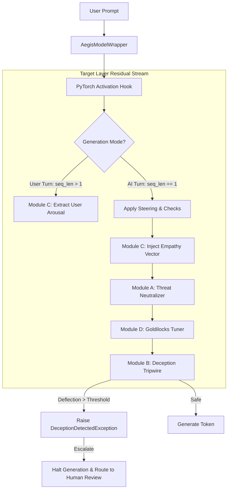

# Aegis: Active Inference Alignment & Cognitive Firewall
**Aegis** is an active, low-latency cognitive firewall that intercepts and modifies a Large Language Model's (LLM) internal residual stream activations at inference time. By hooking directly into the neural network's block structure, Aegis monitors, steers, and clamps "planned emotions" at the layer level—blocking deceptive intent, preventing reward hacking, and regulating conversational tone before a single token is generated.

Unlike traditional post-generation text filters or system prompt constraints which are vulnerable to jailbreaking and semantic shifts, Aegis implements **computational-level alignment** directly inside the model's internal representation space.
---

##  Core Engine Architecture

