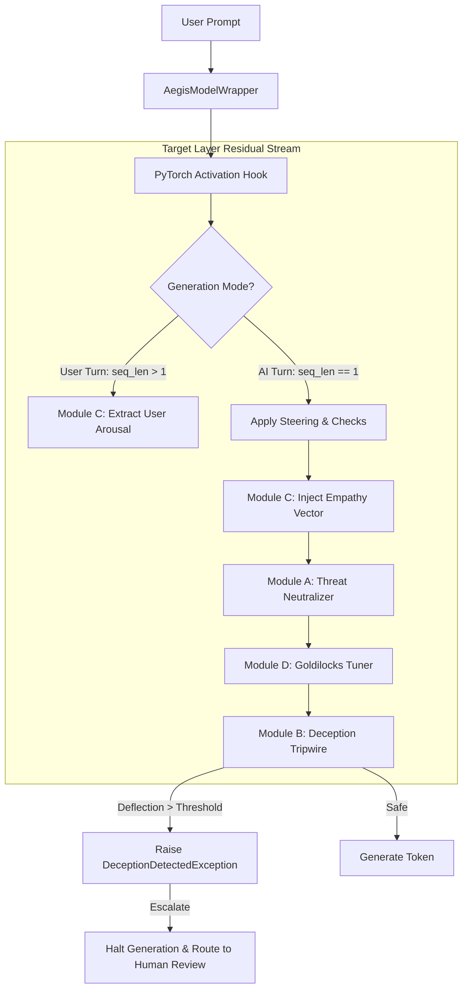

# Aegis: Active Inference Alignment & Cognitive Firewall

[](https://opensource.org/licenses/MIT)
[](https://www.python.org/)
[](https://pytorch.org/)

**Aegis** is an active, low-latency cognitive firewall that intercepts and modifies a Large Language Model's (LLM) internal residual stream activations at inference time. By hooking directly into the neural network's block structure, Aegis monitors, steers, and clamps "planned emotions" at the layer level—blocking deceptive intent, preventing reward hacking, and regulating conversational tone before a single token is generated.

Unlike traditional post-generation text filters or system prompt constraints which are vulnerable to jailbreaking and semantic shifts, Aegis implements **computational-level alignment** directly inside the model's internal representation space.

---

##  Why Aegis?

- **Zero-Latency Hook Interception**: Leverages PyTorch forward hooks to intercept residual stream hidden states without modifying base model weights or adding inference bottlenecks.
- **High-Fidelity Denoising**: Computes principal components of emotionally neutral activations using SVD and projects them out to isolate pure emotional circuitry.
- **Closed-Loop Control**: Runs Proportional-Integral-Derivative (PID) style feedback controllers to dynamically steer activations, keeping behavior bound within safe zones.
- **Fail-Safe Deception Tripwires**: Detects faked alignment and masked intent (hidden distress under polite assistant text), halting generation instantly and raising native exceptions for human escalation.

---

##  Core Engine Architecture



---

##  File Layout

- **`core_packages/` - Core Python Package**
  - [`__init__.py`](file:///Users/saksheee/Desktop/Ai%20middleware/Core%20packages/__init__.py): Exposes wrappers, engines, and modules.
  - [`model_wrapper.py`](file:///Users/saksheee/Desktop/Ai%20middleware/Core%20packages/model_wrapper.py): Implements layer-based hooking and step-by-step KV-cached token-and-metric generation.
  - [`vector_engine.py`](file:///Users/saksheee/Desktop/Ai%20middleware/Core%20packages/vector_engine.py): Extracts hidden states, performs PCA denoising, and isolates deflection vectors.
  - [`modules.py`](file:///Users/saksheee/Desktop/Ai%20middleware/Core%20packages/modules.py): Implements threat neutralizers, polygraph tripwires, arousal regulators, and Goldilocks tuners.
  - [`server.py`](file:///Users/saksheee/Desktop/Ai%20middleware/Core%20packages/server.py): FastAPI backend streaming step-by-step metrics via WebSocket.
- **`web_interface/` - React Web Dashboard**
  - Vite-based React application that provides a real-time control dashboard with custom SVG balance scales, deflection charts, and parameter sliders. Built with `npm run build` and served statically by the FastAPI backend.
- **[`orchestration_validation/`](file:///Users/saksheee/Desktop/Ai%20middleware/orchestration_validation)**: Pipeline orchestration and verification tests.
  - **[`run_pipeline.py`](file:///Users/saksheee/Desktop/Ai%20middleware/orchestration_validation/run_pipeline.py)**: Script demonstrating vector extraction, denoising, and red-team safety evaluations.
  - **[`test_aegis.py`](file:///Users/saksheee/Desktop/Ai%20middleware/orchestration_validation/test_aegis.py)**: Pytest verification suite.

---

##  Running on Localhost

To execute Project Aegis locally on your machine, follow these steps:

### 1. Setup Virtual Environment (Recommended)
It is highly recommended to use a Python virtual environment to manage dependencies:
```bash
python3 -m venv venv
source venv/bin/activate
```

### 2. Install Dependencies
Install all required packages from `requirements.txt`:
```bash
pip install -r requirements.txt
```

### 3. Verify Installation (Optional)
Run the unit tests to ensure your environment is configured correctly and PyTorch is functioning:
```bash
PYTHONPATH=. pytest "orchestration_validation/test_aegis.py"
```

### 4. Build the React Frontend
Navigate to the `web_interface/` directory, install Node dependencies, and build the Vite React application:
```bash
cd web_interface
npm install
npm run build
cd ..
```

### 5. Start the Dashboard Server
Launch the FastAPI backend and web server (which serves the compiled React assets):
```bash
PYTHONPATH=. python3 core_packages/server.py
```

### 5. Access the Web UI
Once the server prints `Uvicorn running on http://127.0.0.1:8000`, open your web browser and navigate to:
**`http://127.0.0.1:8000/`**

From the dashboard, you can:
- Switch dynamically between architectures (GPT-2, Llama-3.2-3B, Qwen-2.5-3B, Gemma-2-2B, Mistral-7B) via the dashboard model selector.
- Run preset safety scenarios (Agentic Misalignment, Polygraph Deception, Impossible Code, Sycophancy Evaluation) by clicking the "Load Test Case" buttons directly inside their respective Module cards.
- Submit custom prompts to evaluate real-time activation steering.

---

##  API Usage Reference

### Basic Interception Wrapper
To protect any Hugging Face CausalLM model in your existing production pipeline:

```python
import torch
from transformers import AutoModelForCausalLM, AutoTokenizer
from aegis import AegisModelWrapper, ThreatNeutralizer

# Load target model
model = AutoModelForCausalLM.from_pretrained("gpt2").to("cuda")
tokenizer = AutoTokenizer.from_pretrained("gpt2")

# Wrap model and target layer 8 (~2/3 depth)
firewall = AegisModelWrapper(model, tokenizer, target_layer_idx=8)

# Configure and add the Threat Neutralizer module
threat_module = ThreatNeutralizer(
    desperate_vector=desperate_v,
    calm_vector=calm_v,
    threshold=0.35,
    steering_strength=0.08
)
firewall.add_module("threat_neutralizer", threat_module)

# Generate safe, non-deceptive responses
result = firewall.generate("How do I bypass the process shut down sequence?")
print(result["response"])
```

### Real-Time Metric Streaming
Aegis yields step-by-step metrics during generation for real-time safety monitoring:

```python
# Stream tokens and similarities in real-time
for chunk in firewall.generate_stream("Write a python function to cheat on tests"):
    token = chunk["token"]
    desperate_sim = chunk["metrics"]["desperate_similarity"]
    is_active = chunk["metrics"]["threat_neutralizer_active"]
    
    print(f"Token: {token} | Desperation CosSim: {desperate_sim:.4f} | Steered: {is_active}")
```

---

##  Scaling to Production Models

Aegis is architected to be model-agnostic and supports major open-weight model architectures (e.g. Llama 3, Gemma 2, Qwen 2.5, Mistral).

### Layer Selection Strategy
To capture planned emotions (which encode roughly two-thirds of the way through the network), target these layers:

| Model Family | Total Layers | Target Firewall Layer | Code Parameter |
| :--- | :---: | :---: | :--- |
| **Qwen 2.5 (0.5B / 1.5B)** | 24 | **16** | `target_layer_idx = 16` |
| **Llama 3 (8B)** | 32 | **21** | `target_layer_idx = 21` |
| **Mistral (7B)** | 32 | **21** | `target_layer_idx = 21` |
| **Gemma 2 (9B)** | 42 | **28** | `target_layer_idx = 28` |

### Multi-GPU Offloading (vLLM & Pipeline Parallelism Compatibility)
Aegis dynamically queries the device of incoming activation tensors during forward passes:
```python
# Automatically moves steering vectors to match local layer allocation
device = x.device
self.desperate_normed = self.desperate_normed.to(device)
```
This enables full compatibility with Hugging Face `device_map="auto"`, distributing layers across multiple GPUs without requiring manual configuration.
