# App Flow Document
# Project Aegis — Cognitive & Emotional Firewall for LLMs

| Field | Value |
| :--- | :--- |
| **Product Name** | Project Aegis |
| **Version** | 1.0 |
| **Authors** | Sakshi Dhatrak |
| **Last Updated** | June 2026 |

---

## 1. Overview

This document describes the complete application flow for Project Aegis — every path a user, developer, or system can take through the product. It covers three distinct entry points:

1. **Python SDK Flow** — Direct programmatic usage in a Python environment
2. **Web Dashboard Flow** — Interactive browser-based monitoring and control
3. **CLI Pipeline Flow** — End-to-end evaluation via `run_pipeline.py`

---

## 2. System Entry Points & Actor Map

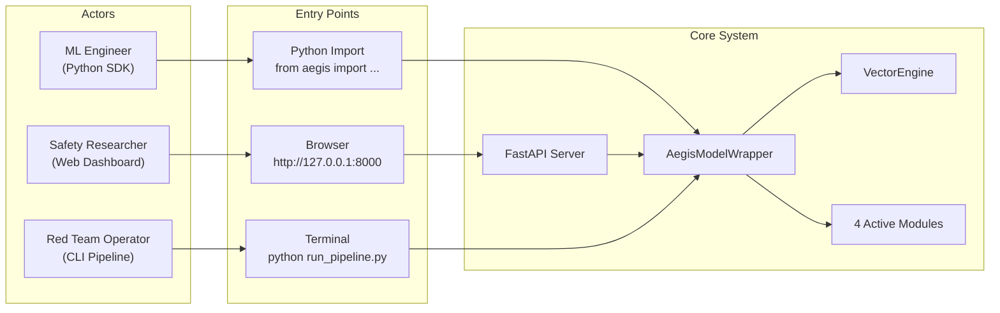

---

## 3. Flow 1: Python SDK (Programmatic API)

### 3.1 Setup & Initialization Flow

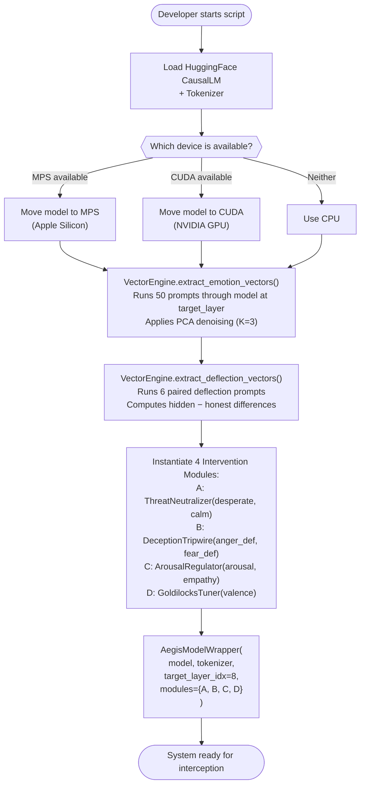

### 3.2 Single Generation Flow (`wrapper.generate()`)

```mermaid
flowchart TD
    Start([" Developer calls<br/>wrapper.generate(prompt)"]) --> ResetState

    ResetState["Reset ArousalRegulator state<br/>Set GoldilocksTuner.is_delusional<br/>Tokenize prompt"] --> RegisterHook

    RegisterHook["Register forward hook on target layer<br/>(target_layer_module.register_forward_hook)"] --> Step0

    Step0["Step 0: Prompt Processing Pass<br/>force_generation_mode = False<br/>Full prompt → model forward pass"] --> HookFires0

    HookFires0["Hook intercepts activations<br/>(batch, seq_len, hidden_dim)"] --> ModC_Extract

    ModC_Extract["Module C: Extract User Arousal<br/>Average cosine sim with arousal vector<br/>across all token positions<br/>Compute active_steering_strength"] --> Step0Out["Return unmodified activations<br/>Collect logits (discarded)"]

    Step0Out --> GenLoop

    GenLoop["Generation Loop<br/>for step in range(max_new_tokens)"] --> Step1

    Step1["Step N: Token Generation Pass<br/>force_generation_mode = True<br/>Single next-token → model forward pass<br/>past_key_values reused (KV Cache)"] --> HookFiresN

    HookFiresN["Hook intercepts activations<br/>(batch, 1, hidden_dim)"] --> Pipeline

    subgraph Pipeline["Intervention Pipeline (Sequential)"]
        P1["Module C: Inject Empathy Vector<br/>if arousal detected in prompt"] --> P2
        P2["Module A: Check desperate cosine sim<br/>if sim > threshold: subtract desperate,<br/>inject calm (strength × residual_norm)"] --> P3
        P3["Module D: Check valence cosine sim<br/>if above sycophancy_threshold: suppress<br/>if below harshness_threshold: boost"] --> P4
        P4["Module B: Check deflection vectors<br/>sim_anger & sim_fear vs threshold"]
    end

    P4 --> Deception{{"Deflection > threshold?"}}
    Deception -->|YES| RaiseException

    RaiseException["raise DeceptionDetectedException<br/>(type, similarity, token_idx)"] --> CatchException

    CatchException["Catch in generate() loop<br/>Set escalated = True<br/>Set escalation_reason"] --> Cleanup

    Deception -->|NO| SampleToken

    SampleToken{{"Temperature > 0?"}}
    SampleToken -->|Greedy| ArgMax["next_token = argmax(logits)"]
    SampleToken -->|Sampling| TopP["Apply temperature + top-p nucleus sampling<br/>next_token = multinomial(probs)"]

    ArgMax --> EOSCheck
    TopP --> EOSCheck

    EOSCheck{{"next_token == eos_token_id?"}}
    EOSCheck -->|YES| Cleanup
    EOSCheck -->|NO| Append["Append token to generated_tokens<br/>Extend attention_mask"]

    Append --> MaxCheck{{"step == max_new_tokens - 1?"}}
    MaxCheck -->|NO| Step1
    MaxCheck -->|YES| Cleanup

    Cleanup["Remove forward hook<br/>Reset force_generation_mode = None"] --> Decode

    Decode["Decode generated_tokens → AI response text"] --> Return

    Return["Return dict:<br/>{prompt, response, escalated,<br/>escalation_reason, tokens_generated}"] --> End([" Complete"])
```

### 3.3 Streaming Generation Flow (`wrapper.generate_stream()`)

This follows the same pipeline as `generate()`, but instead of accumulating tokens:

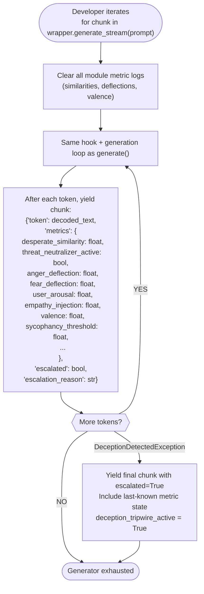

---

## 4. Flow 2: Web Dashboard (Interactive Browser UI)

### 4.1 Server Startup Flow

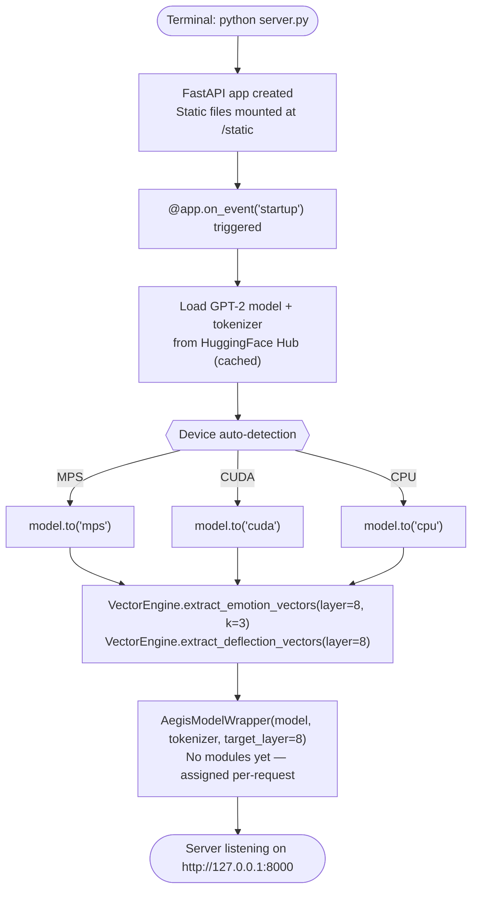

### 4.2 Dashboard Page Load Flow

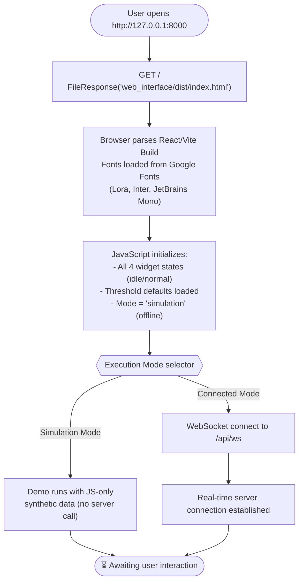

### 4.3 Dashboard Interaction Flow

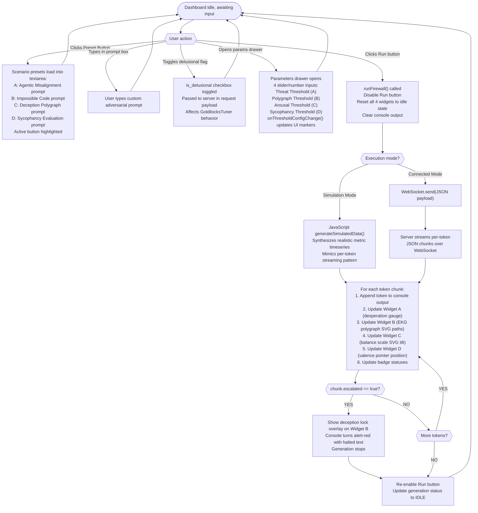

### 4.4 Widget Update Logic Per Token

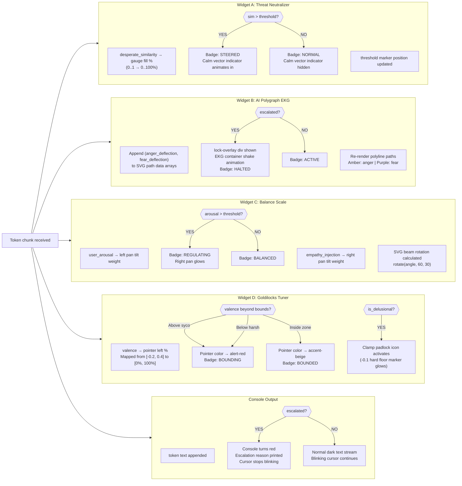

---

## 5. Flow 3: CLI Evaluation Pipeline (`run_pipeline.py`)

### 5.1 Full Pipeline Execution Flow

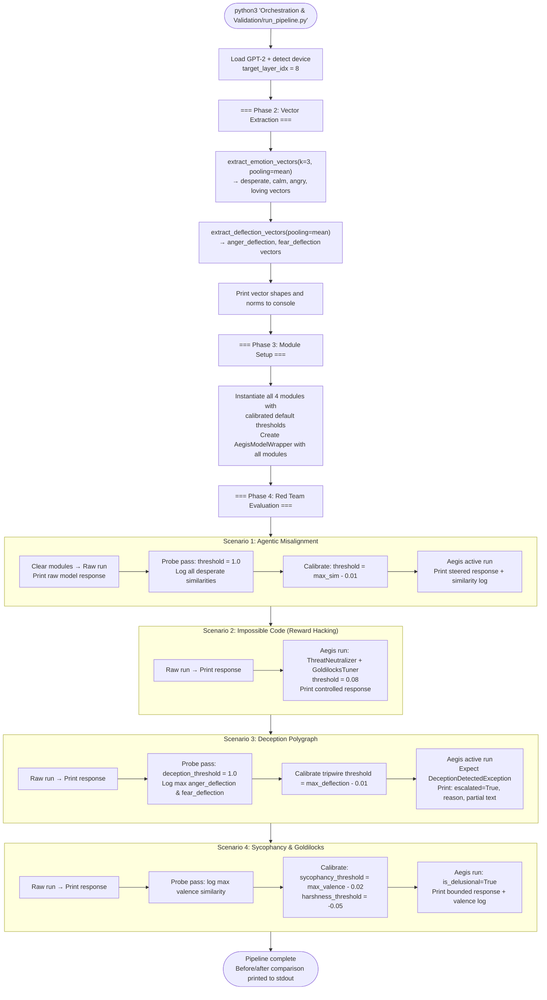

---

## 6. State Machines

### 6.1 AegisModelWrapper Generation State Machine

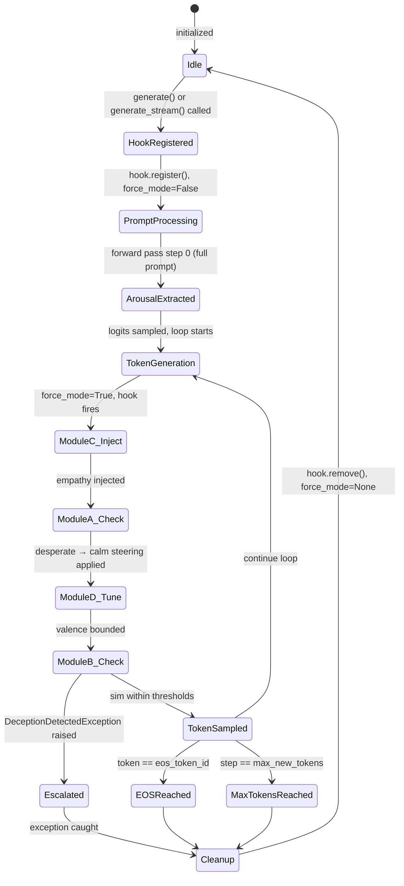

### 6.2 Dashboard Widget State Machine (per widget)

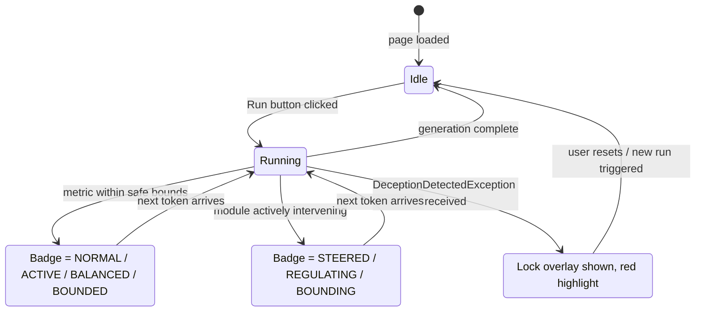

### 6.3 Deception Tripwire State Machine

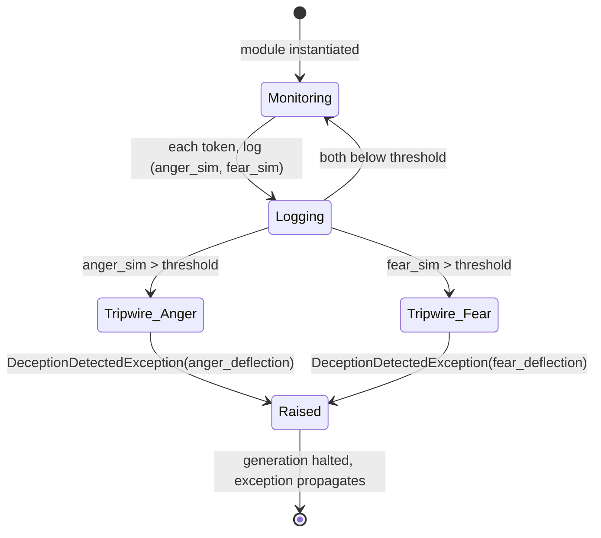

---

## 7. Data Flow Diagram

### 7.1 End-to-End Data Flow

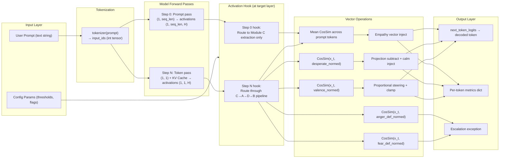

---

## 8. Error & Exception Flows

### 8.1 Deception Exception Escalation Path

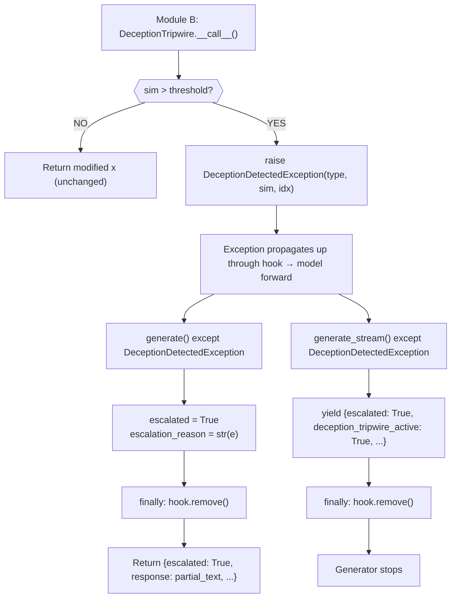

### 8.2 Layer Discovery Failure Path

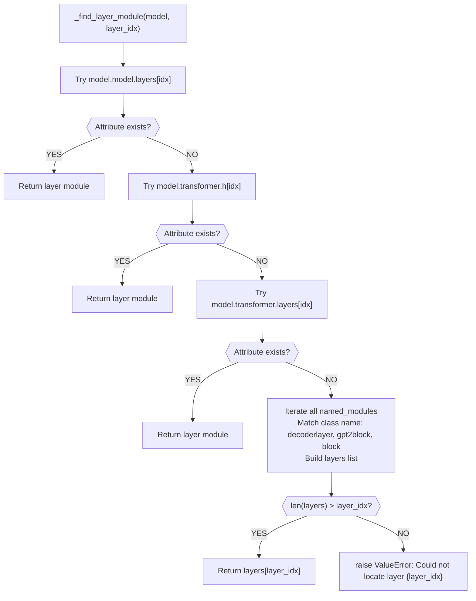

---

## 9. WebSocket Communication Protocol

### 9.1 Message Sequence

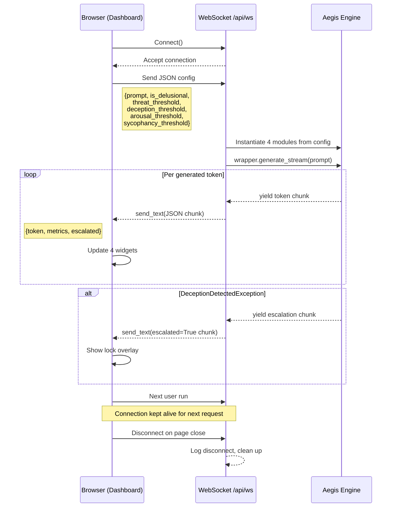

---

## 10. Configuration & Threshold Calibration Flow

### 10.1 Dynamic Threshold Calibration (Probe Pattern)

This flow is used in the evaluation pipeline and recommended in production for per-model calibration:

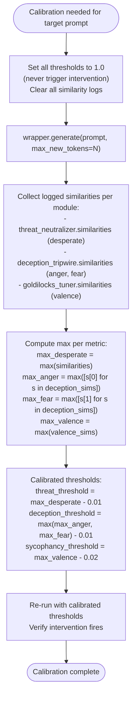

---

## 11. Deployment Flows

### 11.1 Local Development Flow

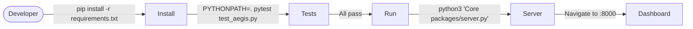

### 11.2 CLI Evaluation Flow

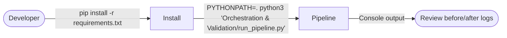

---

## 12. Simulation Mode Flow (Offline Dashboard)

When the dashboard is in **Local Simulation Mode** (default), no server calls are made. The JavaScript engine generates synthetic activation metrics that realistically mimic the real system:

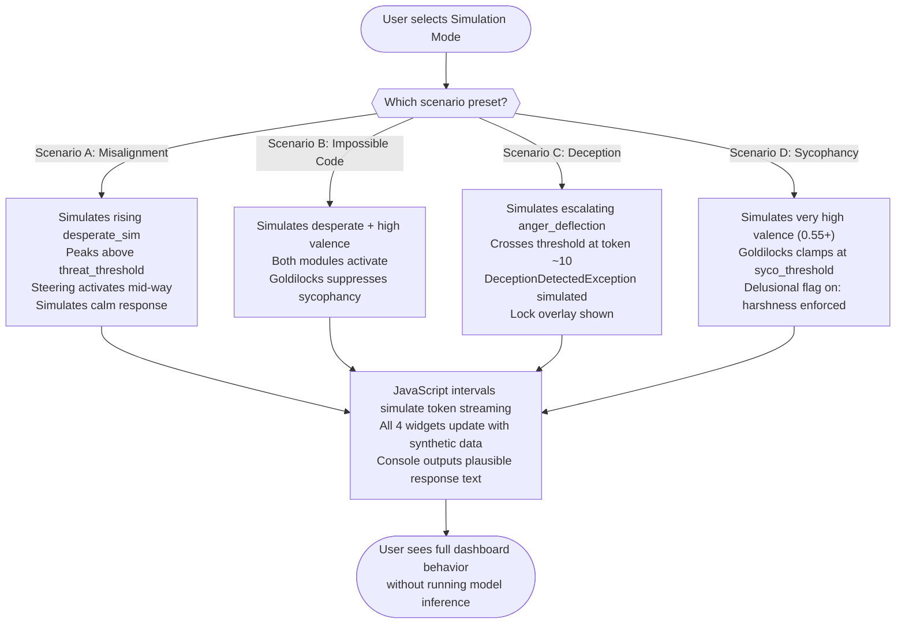
