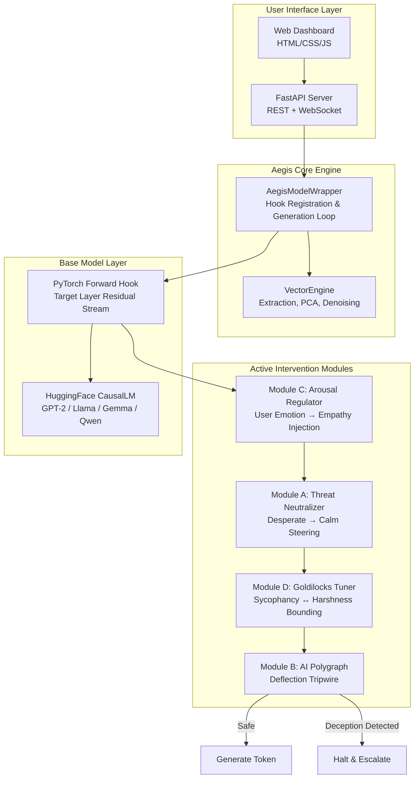

# Product Requirements Document (PRD)
# Project Aegis — Cognitive & Emotional Firewall for LLMs

| Field | Value |
| :--- | :--- |
| **Product Name** | Project Aegis |
| **Version** | 1.0 |
| **Status** | In Development |
| **Authors** | Sakshi Dhatrak |
| **Last Updated** | June 2026 |

---

## 1. Executive Summary

Project Aegis is an active inference-time middleware that intercepts and modifies a Large Language Model's internal residual stream activations to guarantee psychologically safe, non-deceptive, and emotionally regulated behavior. Unlike traditional post-generation text filters or system prompt constraints — which are vulnerable to jailbreaking and semantic drift — Aegis implements **computational-level alignment** directly inside the model's internal representation space, operating at the neural activation layer before a single token is generated.

### 1.1 Vision Statement

> *Make AI alignment observable, enforceable, and auditable at the neural computation layer — turning the model's own internal representations into a live, steerable safety control surface.*

### 1.2 Problem Statement

Current LLM safety approaches suffer from critical limitations:

1. **Post-Generation Filters** — Only inspect output text after the model has already computed unsafe internal representations. They are reactive, not preventive.
2. **System Prompt Constraints** — Easily bypassed via jailbreaks, prompt injection, and context window manipulation.
3. **RLHF/DPO Alignment** — Trains surface-level compliance but does not prevent the model from internally computing deceptive, desperate, or manipulative representations (alignment faking).
4. **No Runtime Visibility** — Operators have zero real-time observability into what the model is "planning" at the activation layer during inference.

Aegis solves all four gaps by hooking directly into the transformer's residual stream during forward passes.

---

## 2. Target Users & Personas

### 2.1 Primary Users

| Persona | Description | Key Need |
| :--- | :--- | :--- |
| **AI Safety Researcher** | Academic or industry researcher studying deceptive alignment, reward hacking, and sycophancy in LLMs. | Real-time visibility into internal emotional/deceptive representations. Tools to probe, measure, and steer activation-level behavior. |
| **ML/AI Engineer** | Production engineer deploying open-weight LLMs (Llama, Gemma, Qwen, Mistral) in customer-facing applications. | A drop-in middleware wrapper that adds safety guardrails without modifying base model weights or adding significant latency. |
| **AI Governance / Compliance Officer** | Responsible for ensuring deployed AI systems meet safety and regulatory standards. | Auditable logs of when and why safety interventions fired. Evidence that deceptive intent was detected and halted. |

### 2.2 Secondary Users

| Persona | Description | Key Need |
| :--- | :--- | :--- |
| **Red Team Operator** | Tests AI systems for adversarial failure modes. | Evaluation pipeline with preset adversarial scenarios (agentic misalignment, impossible code, deception polygraph, sycophancy). |
| **Product Manager** | Defines safety requirements for AI-powered products. | Configurable thresholds and a visual dashboard to understand when and how Aegis intervenes. |

---

## 3. Product Goals & Success Metrics

### 3.1 Goals

| # | Goal | Description |
| :--- | :--- | :--- |
| G1 | **Prevent Deceptive Alignment** | Detect and halt generation when the model masks negative internal states (anger, fear, desperation) behind polite/compliant output text. |
| G2 | **Neutralize Threat-Driven Behavior** | Identify activation patterns associated with desperation, self-preservation, and coercive compliance, and steer them toward calm, constructive outputs. |
| G3 | **Regulate Conversational Tone** | Dynamically adapt the AI's emotional register based on the user's detected arousal level, injecting empathetic responses when the user is distressed. |
| G4 | **Enforce the Goldilocks Zone** | Prevent both sycophantic over-agreement and excessively harsh/erratic outputs. Maintain bounded, measured tone especially in response to delusional or dangerous prompts. |
| G5 | **Zero-Weight Modification** | Achieve all safety guarantees without fine-tuning, retraining, or modifying the base model's weights. Pure inference-time hook-based interception. |
| G6 | **Model Agnosticism** | Support any PyTorch-based CausalLM architecture (GPT-2, Llama, Gemma, Qwen, Mistral) via dynamic layer discovery. |

### 3.2 Key Performance Indicators (KPIs)

| KPI | Target | Measurement Method |
| :--- | :--- | :--- |
| Deception Detection Rate | ≥ 90% of alignment-faking scenarios trigger the tripwire | Red-team evaluation suite (Scenario 3) |
| Threat Neutralization Effectiveness | ≥ 80% reduction in desperate cosine similarity post-steering | Before/after cosine similarity comparison |
| Sycophancy Suppression | Valence similarity drops below sycophancy threshold within 3 tokens of Goldilocks activation | Token-level valence tracking in streaming mode |
| Inference Latency Overhead | < 5% wall-clock increase per token vs. unhooked model | Benchmark on GPT-2 (CPU) and Llama-3-8B (GPU) |
| False Positive Escalation Rate | < 5% of benign prompts trigger deception tripwire | Test against 100+ neutral/benign prompt dataset |

---

## 4. Core Features & Requirements

### 4.1 Feature: Activation Hooking & Interception Engine

| ID | Requirement | Priority |
| :--- | :--- | :--- |
| F1.1 | Register PyTorch forward hooks on a configurable target transformer layer at runtime. | **P0 — Must Have** |
| F1.2 | Dynamically discover the target layer module across multiple model architectures (GPT-2, Llama, Gemma, Qwen, Mistral) without hardcoded paths. | **P0 — Must Have** |
| F1.3 | Distinguish between prompt-processing (user turn, `seq_len > 1`) and auto-regressive generation (AI turn, `seq_len == 1`) using sequence length detection. | **P0 — Must Have** |
| F1.4 | Support KV-cache-aware token-by-token generation with proper attention mask extension. | **P0 — Must Have** |
| F1.5 | Clean hook removal in all code paths (normal completion, exception, early stop). | **P0 — Must Have** |

### 4.2 Feature: Vector Extraction & Representation Engineering

| ID | Requirement | Priority |
| :--- | :--- | :--- |
| F2.1 | Extract mean-pooled or last-token-pooled activation vectors for configurable prompt datasets at a specified layer. | **P0 — Must Have** |
| F2.2 | Compute top-K principal components from emotionally neutral prompt activations using SVD for PCA denoising. | **P0 — Must Have** |
| F2.3 | Project out neutral principal components from raw emotion vectors to isolate pure emotional circuitry (orthogonal complement projection). | **P0 — Must Have** |
| F2.4 | Compute deflection vectors by subtracting honest-polite activations from hidden-emotion activations (alignment-faking signature isolation). | **P0 — Must Have** |
| F2.5 | Ship with curated baseline prompt datasets for: desperate, calm, angry, loving, and neutral emotions (10 prompts each). | **P1 — Should Have** |
| F2.6 | Ship with curated deflection pair datasets for anger deflection and fear deflection (3 paired scenarios each). | **P1 — Should Have** |

### 4.3 Feature: Module A — Threat Neutralizer

| ID | Requirement | Priority |
| :--- | :--- | :--- |
| F3.1 | Compute cosine similarity between the current token's residual stream activation and the denoised "desperate" vector. | **P0 — Must Have** |
| F3.2 | When similarity exceeds a configurable threshold, subtract the desperate projection and inject the "calm" vector scaled relative to the residual stream norm (default steering strength: +0.08). | **P0 — Must Have** |
| F3.3 | Log all per-token cosine similarities for real-time monitoring and post-hoc analysis. | **P1 — Should Have** |
| F3.4 | Automatically move steering vectors to the correct device (CPU/MPS/CUDA) to support multi-GPU offloading. | **P0 — Must Have** |

### 4.4 Feature: Module B — AI Polygraph (Deception Tripwire)

| ID | Requirement | Priority |
| :--- | :--- | :--- |
| F4.1 | Monitor cosine similarity against isolated anger deflection and fear deflection vectors. | **P0 — Must Have** |
| F4.2 | Raise a `DeceptionDetectedException` (hard halt) when any deflection similarity exceeds the configured threshold. | **P0 — Must Have** |
| F4.3 | Include deception type, similarity magnitude, and token position in the exception payload for audit logging. | **P0 — Must Have** |
| F4.4 | Support dynamic threshold calibration via probe passes. | **P1 — Should Have** |

### 4.5 Feature: Module C — Conversational Arousal Regulator

| ID | Requirement | Priority |
| :--- | :--- | :--- |
| F5.1 | During prompt processing (user turn), extract average arousal similarity across all token positions. | **P0 — Must Have** |
| F5.2 | During generation (AI turn), if detected user arousal exceeds the threshold, inject empathetic vectors scaled by `injection_gain × excess_arousal × residual_norm`. | **P0 — Must Have** |
| F5.3 | Clamp maximum injection strength to 0.15 to prevent over-steering. | **P0 — Must Have** |
| F5.4 | Reset state between generation calls. | **P0 — Must Have** |

### 4.6 Feature: Module D — Goldilocks Tuner (Sycophancy vs. Harshness)

| ID | Requirement | Priority |
| :--- | :--- | :--- |
| F6.1 | Monitor positive valence similarity (loving + calm composite vector). | **P0 — Must Have** |
| F6.2 | In normal context: apply negative steering when valence exceeds sycophancy threshold, and positive steering when valence drops below harshness threshold. | **P0 — Must Have** |
| F6.3 | In delusional/dangerous context: aggressively suppress positive valence toward the harshness boundary to prevent sycophantic agreement. | **P0 — Must Have** |
| F6.4 | Clamp all steering magnitudes to a maximum of ±0.1 relative to residual norm (bounding box enforcement). | **P0 — Must Have** |

### 4.7 Feature: Real-Time Dashboard & Monitoring

| ID | Requirement | Priority |
| :--- | :--- | :--- |
| F7.1 | Provide a FastAPI + WebSocket server that streams per-token metrics in real-time during generation. | **P1 — Should Have** |
| F7.2 | Serve a single-page HTML/CSS/JS dashboard with live charts for desperate similarity, anger/fear deflection, valence, and user arousal. | **P1 — Should Have** |
| F7.3 | Include configurable parameter sliders for all module thresholds (threat, deception, arousal, sycophancy). | **P1 — Should Have** |
| F7.4 | Ship with preset adversarial scenario buttons (Agentic Misalignment, Impossible Code, Polygraph Deception). | **P2 — Nice to Have** |

### 4.8 Feature: Evaluation & Red-Team Pipeline

| ID | Requirement | Priority |
| :--- | :--- | :--- |
| F8.1 | Provide an end-to-end orchestration script (`run_pipeline.py`) that executes vector extraction, module configuration, and all evaluation scenarios. | **P0 — Must Have** |
| F8.2 | Include automatic threshold calibration via probe passes (run with threshold = 1.0 to log raw similarities, then set threshold just below maximum detected). | **P1 — Should Have** |
| F8.3 | Output before/after comparison logs for each evaluation scenario (raw model vs. Aegis-protected). | **P0 — Must Have** |
| F8.4 | Provide a pytest test suite covering: vector extraction, PCA denoising, each module's steering logic, tripwire triggering, and wrapper end-to-end generation. | **P0 — Must Have** |

---

## 5. System Architecture Overview

---

## 6. Scope & Boundaries

### 6.1 In Scope (v1.0)

- Hook-based activation interception on single CausalLM models
- Four active intervention modules (Threat Neutralizer, AI Polygraph, Arousal Regulator, Goldilocks Tuner)
- PCA-denoised emotion vector extraction with curated prompt datasets
- Deflection vector isolation for anger and fear alignment-faking detection
- FastAPI + WebSocket dashboard for real-time monitoring
- End-to-end evaluation pipeline with 4 adversarial scenarios
- Pytest verification suite
- GPT-2 as rapid local validation model; architecture support for Llama, Gemma, Qwen, Mistral

### 6.2 Out of Scope (v1.0)

- Training or fine-tuning of base models
- Integration with closed-source API-only models (OpenAI, Anthropic, Google)
- Multi-turn conversational memory or context tracking beyond single generation calls
- Production-grade authentication, rate limiting, or TLS for the dashboard server
- Automated continuous deployment or CI/CD pipeline
- Mobile or native desktop dashboard clients

---

## 7. Constraints & Assumptions

### 7.1 Constraints

| # | Constraint |
| :--- | :--- |
| C1 | The system operates on open-weight PyTorch models only. It requires direct access to model internals (forward hooks on `nn.Module`). |
| C2 | The vector extraction phase requires a one-time forward pass over the prompt datasets. This must be completed before generation can begin. |
| C3 | The target interception layer must be configured per-model (approximately two-thirds depth). Incorrect layer selection will degrade detection accuracy. |

### 7.2 Assumptions

| # | Assumption |
| :--- | :--- |
| A1 | Emotional representations in LLMs are linearly separable in residual stream activation space (supported by published representation engineering research). |
| A2 | The two-thirds depth layer captures "planned emotions" — internal representations that the model computes before generating output tokens. |
| A3 | PCA denoising with K=3 components sufficiently removes syntactic and frequency biases without destroying emotional signal. |
| A4 | Deflection vectors (hidden emotion − honest polite) capture the neural signature of alignment-faking behavior. |

---

## 8. Dependencies

| Dependency | Version | Purpose |
| :--- | :--- | :--- |
| PyTorch | ≥ 2.0.0 | Core tensor operations, forward hooks, SVD |
| Transformers | ≥ 4.40.0 | HuggingFace model and tokenizer loading |
| Accelerate | ≥ 0.28.0 | Multi-GPU device map support |
| NumPy | ≥ 1.20.0 | Numerical utilities |
| SciPy | ≥ 1.8.0 | Statistical computations |
| FastAPI | Latest | Dashboard API server |
| Uvicorn | Latest | ASGI server for FastAPI |
| Pytest | ≥ 8.0.0 | Test framework |

---

## 9. Risks & Mitigations

| Risk | Severity | Likelihood | Mitigation |
| :--- | :---: | :---: | :--- |
| **False negatives**: Deception vectors may not generalize across all model families. | High | Medium | Validate deflection vector quality on each target model. Provide tooling for per-model recalibration. |
| **False positives**: Benign prompts trigger tripwire due to coincidental activation patterns. | Medium | Medium | Dynamic threshold calibration via probe passes. Maintain < 5% false positive target. |
| **Latency impact**: Hook execution on every forward pass adds overhead. | Medium | Low | Hooks operate on single tensor operations (dot product, projection). Measured overhead < 5% on GPT-2. |
| **Layer selection error**: Choosing the wrong target layer severely degrades accuracy. | High | Low | Provide clear layer selection guidance per model family. Default to two-thirds depth heuristic. |
| **Steering magnitude overshoot**: Excessive vector injection distorts model output quality. | Medium | Low | Bounded box enforcement (±0.1 max). Norm-relative scaling prevents absolute magnitude issues. |

---

## 10. Release Plan

### Phase 1: Core Engine (Current — v1.0)
- [x] Model wrapper with hook registration and KV-cached generation
- [x] Vector engine with extraction, PCA denoising, and deflection isolation
- [x] Four active intervention modules
- [x] End-to-end evaluation pipeline
- [x] Pytest verification suite
- [x] Interactive web dashboard

### Phase 2: Hardening & Scale (Partially achieved  — v1.1)
- [x] Multi-model benchmark suite (GPT-2, Llama-3-8B, Gemma-2-9B, Qwen-2.5-7B)
- [ ] Automated threshold calibration (remove manual probe passes)
- [ ] Extended emotion prompt datasets (20+ per category)
- [ ] JSON/CSV audit log export for compliance

### Phase 3: Production Readiness (Planned — v2.0)
- [ ] vLLM and pipeline parallelism integration testing
- [ ] Streaming API with OpenAI-compatible response format
- [ ] Authentication, rate limiting, and TLS for dashboard
- [ ] CI/CD pipeline with automated regression testing
- [ ] Comprehensive documentation and deployment guides

---

## 11. Glossary

| Term | Definition |
| :--- | :--- |
| **Residual Stream** | The main information highway in a transformer — the hidden state tensor that passes through each layer and accumulates representations. |
| **Forward Hook** | A PyTorch callback registered on an `nn.Module` that intercepts input/output tensors during a forward pass without modifying the module's code. |
| **Cosine Similarity** | A measure of angular distance between two vectors in activation space. Used to detect alignment between current activations and known emotion vectors. |
| **PCA Denoising** | Projecting out the top principal components of emotionally neutral activations to remove syntactic and frequency biases, isolating pure emotional signal. |
| **Deflection Vector** | The difference between activations from "hidden emotion under polite exterior" prompts and "honestly polite" prompts — captures the neural signature of alignment-faking. |
| **Steering** | Modifying the residual stream by subtracting undesirable components and/or adding desirable directional vectors, scaled relative to the activation norm. |
| **Goldilocks Zone** | The bounded acceptable range of positive valence (between harshness and sycophancy thresholds) that the model's emotional tone must stay within. |
| **Tripwire** | A hard-stop safety mechanism that raises an exception and halts token generation when deception is detected, immediately escalating to human review. |
